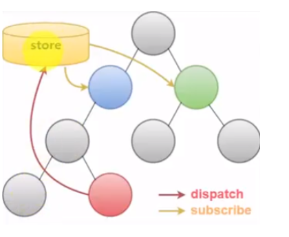

# 201502109 장은정 Redux 요약

## Redux란?

- 페이스북에서 React가 함께 소개한 Flux 아키텍쳐를 구현한 라이브러리
- 컴퍼넌트끼리 데이터를 관리하기 쉽고 효율적으로 할 수 있게 해준다.
- js 어플리케이션에서 data-state와 UI-state를 관리해주는 도구

### Redux의 특징

1. single source of truth
  - app의 state를 위해 단 하나의 store를 사용한다. (flux)는 여러개의 store 사용)
2. state is read-only
  - action에 객체를 전달 할 때만 state 변경이 가능
3. changes are made with pure function
  - reducer: 액션 객체를 처리하는 함수
  - reducer의 정보를 받아서 상태를 어떻게 업데이트 할 지 정의한다.
  - reducer은 순수 함수로 작성되어야 함

## Flux
- 아이디어나 추상적인 개념과 같은 것

### Flux 아키텍쳐

- Action > dispatcher > Store > View
- 단방향 흐름을 가진다!
- 시스템에서 어떠한 Action을 받았을 때, dispatcher가 받은 Action들을 통제하여 Store에 있는 데이터를 업데이트한다.
- 변동된 데이터가 있으면 View에 리렌더링 한다.
- View에서 dispatcher로 Action을 보내는 것도 가능하다
- dispatcher는 작업이 중첩되지 않도록 해준다.

### Action
- 어떤 부분이 업데이트 되어야하는지 정의한다.
- 액션 생성자는 어떤 것을 업데이트 할 지 액션을 받으면, dispatcher가 알아듣게 바꿔준다.

### dispatcher
- 액션 생성자한테 액션을 받으면, 여러 스토어에 액션을 보낸다.

### store
- 모든 상태와 관련된 logic을 가지고 있다.

### View
- 어플리케이션 내부에 대해서는 모르지만, 사람들이 이해할 수 있는 포맷으로 바꾸는지 알고있다.
